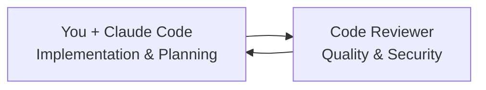

# 🤖 Kinda-Lang Claude Code Agents

Specialized Claude Code agents for streamlined kinda-lang development workflow automation.

## 🎯 Streamlined Agent Architecture

This repository contains **one specialized Claude Code agent** designed for streamlined kinda-lang development:

### 1. 🔍 **Code Reviewer Agent**
- **Role**: Quality assurance, security review, and PR management
- **Claude Code Tools**: Read, Grep, Bash (for testing), TodoWrite
- **Responsibilities**:
  - Review code for quality, security, and best practices
  - Ensure adherence to project standards using comprehensive analysis
  - Run test suites and verify coverage requirements
  - Full PR approval and merge authority
  - Maintain project excellence and catch security issues

### 📁 **Archived Agents**
The `agents/archived/` directory contains additional agents (Project Manager, Coder, Scrum Master) that were designed for more complex workflows but aren't needed for the current streamlined You → Reviewer flow.

## 🔄 Streamlined Claude Code Workflow



1. **You + Claude Code** handle planning, implementation, and task management based on roadmap
2. **Code Reviewer** ensures quality gates, runs comprehensive tests, and merges PRs
3. **Continuous Cycle**: After review/merge, you select next priority from roadmap

### Why This Streamlined Approach Works:
- **Direct Control**: You maintain full context of both planning and implementation
- **Efficient Flow**: Fewer handoffs mean faster development cycles  
- **Quality Assurance**: Dedicated reviewer maintains high standards
- **Roadmap Driven**: ROADMAP.md file provides clear priority guidance

## 🚀 Getting Started

These agents work seamlessly within Claude Code environments:

```bash
# Check roadmap and implement next priority:
# Refer to ROADMAP.md for current priorities and work on next logical task

# After you implement features:
"Use the kinda-lang code reviewer agent to review PR #X and merge if approved"

# Continuous development:
# After review/merge, consult ROADMAP.md for next priority task
```

## 📁 Structure

```
kinda-lang-agents/
├── agents/
│   ├── reviewer.md          # Code Reviewer agent (ACTIVE)
│   └── archived/            # Reference agents for complex workflows
│       ├── project_manager.md # Project Manager agent (archived)
│       ├── coder.md         # Implementation agent (archived)
│       └── scrum_master.md  # Coordination agent (archived)
├── examples/                # Example workflows  
├── templates/               # Task and review templates
└── docs/                   # Documentation
```

## 🤖 Agent Prompts

Each agent is defined by a specialized prompt that gives Claude Code specific instructions, tool usage patterns, and behavioral guidelines for that role.

## 🤷 Why Claude Code Agents?

Just like kinda-lang embraces uncertainty, these agents work with the inherent ambiguity in software development. They leverage Claude Code's powerful tool ecosystem to provide concrete, actionable development workflow automation.

## 📜 License

AGPL v3 - Same as kinda-lang main project