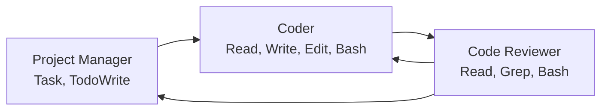

# 🤖 Kinda-Lang Claude Code Agents

Specialized Claude Code agents for kinda-lang development workflow automation.

## 🎯 Agent Architecture

This repository contains three specialized **Claude Code agents** designed to work together for kinda-lang development:

### 1. 🏗️ **Project Manager Agent**
- **Role**: Strategic planning, architecture decisions, and task coordination
- **Claude Code Tools**: Task, TodoWrite, Read, LS, Grep
- **Responsibilities**:
  - Analyze requirements and break down into actionable tasks
  - Make architectural decisions and design patterns
  - Coordinate work between other agents using Task tool
  - Track progress with TodoWrite and manage priorities
  - Review and approve major changes

### 2. 💻 **Coder Agent** 
- **Role**: Implementation and feature development
- **Claude Code Tools**: Read, Write, Edit, MultiEdit, Bash, Grep, Glob
- **Responsibilities**:
  - Implement features based on architect specifications
  - Write clean, tested code following project conventions
  - Run tests and verify functionality with Bash
  - Handle bug fixes and performance improvements
  - Create comprehensive unit tests

### 3. 🔍 **Code Reviewer Agent**
- **Role**: Quality assurance and code review
- **Claude Code Tools**: Read, Grep, Bash (for testing), TodoWrite
- **Responsibilities**:
  - Review code for quality, security, and best practices
  - Ensure adherence to project standards using Grep for pattern analysis
  - Run test suites and verify coverage
  - Suggest improvements and optimizations
  - Approve or request changes before merging

## 🔄 Claude Code Workflow



1. **Project Manager** uses Task tool to analyze requirements and TodoWrite to create implementation plans
2. **Coder** uses Read/Write/Edit tools to implement features and Bash to run tests
3. **Code Reviewer** uses Read/Grep to analyze code quality and Bash to verify tests
4. Cycle repeats until code meets quality standards

## 🚀 Getting Started

These agents are designed to work within Claude Code environments:

```bash
# Each agent can be invoked in Claude Code using:
# "Use the kinda-lang project manager agent to plan this feature"
# "Use the kinda-lang coder agent to implement this"  
# "Use the kinda-lang code reviewer agent to review this PR"
```

## 📁 Structure

```
kinda-lang-agents/
├── agents/
│   ├── project_manager.md    # Project Manager agent prompt
│   ├── coder.md             # Coder agent prompt  
│   ├── reviewer.md          # Code Reviewer agent prompt
│   └── coordinator.md       # Agent coordination guidelines
├── examples/                # Example workflows
├── templates/               # Task and review templates
└── docs/                   # Documentation
```

## 🤖 Agent Prompts

Each agent is defined by a specialized prompt that gives Claude Code specific instructions, tool usage patterns, and behavioral guidelines for that role.

## 🤷 Why Claude Code Agents?

Just like kinda-lang embraces uncertainty, these agents work with the inherent ambiguity in software development. They leverage Claude Code's powerful tool ecosystem to provide concrete, actionable development workflow automation.

## 📜 License

AGPL v3 - Same as kinda-lang main project